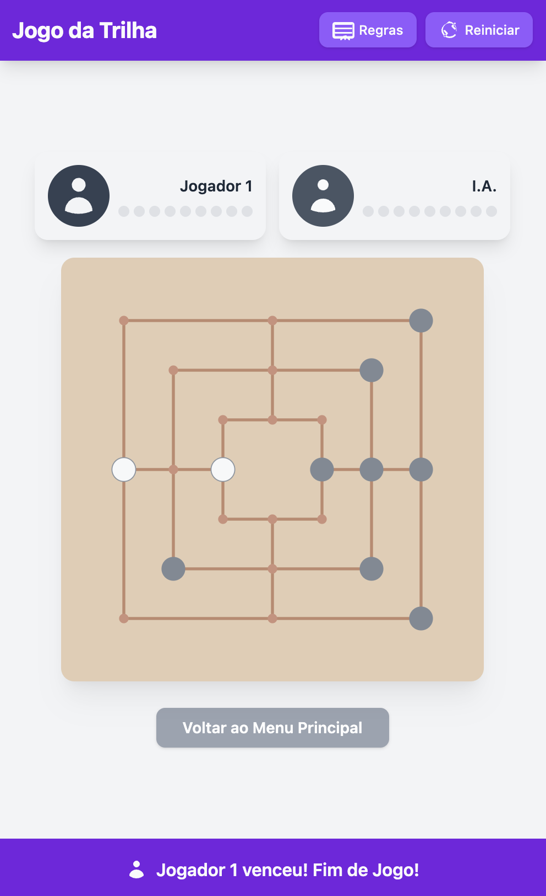

# Jogo da Trilha (Nine Men's Morris)

Bem-vindo ao Jogo da Trilha! Esta é uma implementação web do clássico jogo de tabuleiro estratégico, também conhecido como Moinho, Morris, Merels, ou Nine Men's Morris. Desenvolvido com React, TypeScript e Tailwind CSS, este projeto oferece uma interface moderna e responsiva para jogar contra outro jogador localmente (PvP) ou contra uma Inteligência Artificial (PvA).

## Preview da implementação 1.0.0-stable



## Funcionalidades

- **Responsividade:** Adaptado para diferentes tamanhos de tela (desktop e mobile).
- **Modos de Jogo:**
  - **Jogador vs Jogador (PvP):** Jogue com um amigo no mesmo dispositivo.
  - **Jogador vs Inteligência Artificial (PvA):** Desafie uma IA com lógica básica.
- **Regras Integradas:** Acesso fácil às regras do jogo através de um modal.
- **Feedback Visual:** Destaques visuais para peças selecionadas, movimentos válidos e mensagens de status claras.
- **IA com "Pensamento":** A IA possui um pequeno atraso aleatório para simular o tempo de raciocínio.

## Como Executar o Jogo Localmente

Para executar o Jogo da Trilha localmente, você precisará de Node.js e npm (ou yarn/pnpm) instalados. O projeto utiliza Vite como servidor de desenvolvimento, que lida com a transpilação de TypeScript/JSX e oferece uma ótima experiência de desenvolvimento.

Siga estes passos:

1.  **Clone o repositório ou baixe os arquivos:**
    Certifique-se de ter todos os arquivos do projeto em uma pasta no seu computador.

2.  **Abra um terminal ou prompt de comando** na pasta raiz do projeto.

3.  **Instale as dependências do projeto:**
    Execute o comando abaixo para instalar as ferramentas de desenvolvimento necessárias (como Vite e TypeScript) e as bibliotecas React.

    ```bash
    npm install
    ```

    (Ou `yarn install` se você usa Yarn, ou `pnpm install` se usa PNPM)

4.  **Inicie o servidor de desenvolvimento Vite:**
    Após a instalação das dependências, execute:

    ```bash
    npm run dev
    ```

    (Ou `yarn dev` / `pnpm dev`)

5.  **Abra o jogo no seu navegador:**
    Vite iniciará o servidor e exibirá um endereço local no terminal (geralmente `http://localhost:5173`). Abra este endereço no seu navegador.

O jogo deve carregar e você poderá escolher o modo de jogo na tela inicial.

**Notas sobre as dependências:**

- **Vite:** É um servidor de desenvolvimento moderno e rápido que compila e serve seu código TypeScript/JSX conforme necessário.
- **Tailwind CSS:** Carregado via CDN no `index.html` para estilização.
- **React & ReactDOM:** Embora o `index.html` use um `importmap` para carregar React/ReactDOM via `esm.sh` para o navegador, tê-los listados no `package.json` auxilia o Vite em seu processo de desenvolvimento e otimizações.

Este método garante que o código `.tsx` seja corretamente processado antes de ser enviado ao navegador, resolvendo os problemas de tela branca e erros de MIME type.

## Documentação de Aspectos Importantes

### 1. Estrutura de Dados do Tabuleiro

O tabuleiro do jogo é representado por um array unidimensional chamado `board` no estado do jogo (`GameState`).

- **`board: BoardPositionState[]`**: Um array de 24 posições.
- **`BoardPositionState`**: Pode ser `Player.PLAYER_1`, `Player.PLAYER_2`, ou `null`.
  - `Player.PLAYER_1`: Indica que a posição está ocupada pelo Jogador 1.
  - `Player.PLAYER_2`: Indica que a posição está ocupada pelo Jogador 2 (ou IA).
  - `null`: Indica que a posição está vazia.
- **`POSITIONS_COUNT = 24`**: Constante que define o número total de interseções no tabuleiro.
- **Mapeamento Visual:** As constantes `BOARD_POINTS_COORDS` (em `constants.ts`) fornecem as coordenadas (x, y) para renderizar cada um dos 24 pontos no tabuleiro SVG.

### 2. Lógica do Jogo (`hooks/useTrilhaGame.ts`)

O hook customizado `useTrilhaGame` centraliza toda a lógica do jogo.

- **`gameState: GameState`**: O estado principal do jogo, contendo:

  - `board`: O tabuleiro (descrito acima).
  - `currentPlayer`: O jogador atual.
  - `phase`: A fase atual do jogo (`PLACING`, `MOVING`, `FLYING`, `REMOVE_PIECE`, `GAME_OVER`).
  - `player1Pieces`, `player2Pieces`: Objetos que rastreiam o número de peças no tabuleiro (`onBoard`) e a serem colocadas (`toPlace`) para cada jogador.
  - `selectedPieceIndex`: O índice da peça selecionada para mover.
  - `winner`: `Player` que venceu, ou `null`.
  - `message`: Mensagem de status exibida ao usuário.
  - `justFormedTrilha`: Booleano para controlar a fase de remoção após formar uma trilha.
  - `gameMode`: `PVP` ou `PVA`.

- **`handlePieceClick(index: number)`**: Função principal chamada quando um jogador clica em uma posição do tabuleiro. Ela processa a ação com base na fase atual do jogo e no estado do tabuleiro.

- **`checkTrilhaAt(board, player, movedIndex)`**: Verifica se uma trilha foi formada pelo `player` na posição `movedIndex`. Utiliza a constante `TRILHA_LINES` que define todas as combinações possíveis de trilhas.

- **`isPieceInTrilha(board, pieceIndex)`**: Verifica se a peça na `pieceIndex` faz parte de uma trilha.

- **`canPlayerMove(board, player, playerPiecesOnBoard, currentPhase)`**: Determina se o `player` tem algum movimento válido disponível. Essencial para detectar condições de fim de jogo.

- **`updateGameMessageAndPhase(newState)`**: Atualiza a mensagem de status e, potencialmente, a fase do jogo com base no novo estado.

- **`restartGame()`**: Reinicia o jogo para o estado inicial, mantendo o modo de jogo selecionado.

### 3. Fases do Jogo (`GamePhase`)

O jogo progride através de diferentes fases:

1.  **`PLACING`**: Os jogadores colocam suas 9 peças no tabuleiro.
2.  **`MOVING`**: Após todas as peças serem colocadas, os jogadores movem suas peças para posições adjacentes vazias.
3.  **`FLYING`**: Quando um jogador tem apenas 3 peças restantes, suas peças podem "voar" para qualquer posição vazia no tabuleiro.
4.  **`REMOVE_PIECE`**: Ativada quando um jogador forma uma trilha. O jogador então remove uma peça do oponente.
5.  **`GAME_OVER`**: O jogo termina quando um jogador vence.

### 4. Inteligência Artificial (IA) (`hooks/useTrilhaGame.ts`)

A IA joga como Jogador 2 no modo `PVA`. A lógica de decisão da IA é implementada na função `determineAIMove` e `findBestPieceToRemoveByAI`.

- **Heurística da IA (Greedy Approach):**
  A IA tenta tomar a melhor decisão possível no turno atual, seguindo uma ordem de prioridades:

  - **Fase de Colocação (`PLACING`):**

    1.  **Formar Trilha:** Se a IA pode colocar uma peça para formar uma trilha, ela o faz.
    2.  **Bloquear Trilha do Oponente:** Se o oponente pode formar uma trilha na próxima jogada, a IA tenta colocar sua peça na posição que bloquearia essa trilha.
    3.  **Configurar Duas em Linha (Setup):** Se a IA pode colocar uma peça para criar duas de suas peças em uma linha potencial de trilha (com um espaço vazio para completar a trilha), ela considera essa jogada.
    4.  **Aleatório:** Se nenhuma das opções acima for aplicável, a IA coloca a peça em uma posição vazia aleatória.

  - **Fase de Movimentação/Voo (`MOVING`/`FLYING`):**

    1.  **Formar Trilha:** Se a IA pode mover uma peça para formar uma trilha, ela o faz.
    2.  **Bloquear Trilha do Oponente:** Se o oponente pode formar uma trilha movendo uma de suas peças, a IA tenta mover uma de suas peças para o local de destino do oponente para bloquear.
    3.  **Configurar Duas em Linha (Setup):** Similar à fase de colocação, mas com movimento.
    4.  **Aleatório:** Se nenhuma das opções acima for aplicável, a IA faz um movimento válido aleatório.

  - **Fase de Remoção de Peça (`REMOVE_PIECE`):**
    1.  **Remover Peça Fora de Trilha:** A IA prioriza remover uma peça do oponente que não esteja em uma trilha.
    2.  **Remover Peça em Trilha (se necessário):** Se todas as peças do oponente estão em trilhas, a IA remove uma peça aleatória de uma trilha.
    3.  A seleção é aleatória entre as peças válidas para remoção.

- **`aiTurnInProgress: boolean`**: Estado que impede interações do usuário e múltiplas ações da IA enquanto a IA está "pensando" ou sua ação está sendo processada (com atrasos visuais).
- **Atrasos Aleatórios:** A IA tem um pequeno atraso aleatório antes de cada ação para simular um processo de pensamento e tornar a experiência de jogo mais natural.

## Estrutura de Arquivos Principal

```
.
├── components/                 # Componentes React reutilizáveis
│   ├── Board.tsx               # Renderiza o tabuleiro e as peças
│   ├── GameStatus.tsx          # Exibe mensagens de status do jogo
│   ├── InstructionsModal.tsx   # Modal com as regras do jogo
│   └── PlayerInfo.tsx          # Exibe informações dos jogadores (peças, turno)
├── hooks/
│   └── useTrilhaGame.ts        # Lógica principal e estado do jogo
├── App.tsx                     # Componente principal da aplicação, gerencia telas
├── constants.ts                # Constantes do jogo (coordenadas, linhas de trilha, mensagens)
├── index.html                  # Arquivo HTML principal, ponto de entrada para Vite
├── index.tsx                   # Ponto de entrada da aplicação React (referenciado por index.html)
├── types.ts                    # Definições de tipos TypeScript
├── metadata.json               # Metadados da aplicação
├── package.json                # Define dependências e scripts do projeto
├── vite.config.ts              # Configuração do Vite
└── README.md                   # Este arquivo
```
